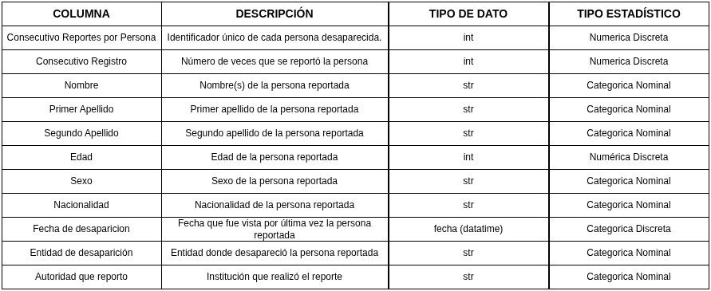

# Empresa y metodología de Minería de Datos

Cada integrante del equipo deberá elegir una empresa distinta en la que le gustaría trabajar e investigar qué metodología utiliza para desarrollar proyectos de Minería de Datos.

- **Zianya:** BBVA aplica CRISP-DM siguiendo 6 pasos:
  1. Comprensión del negocio y definición del objetivo
  2. Comprensión de los datos
  3. Análisis y preparación de los datos
  4. Modelado
  5. Obtención de resultados
  6. Despliegue  
  Fuente: [BBVA](https://www.bbva.com/es/empresas/como-puede-ayudar-el-data-mining-a-las-empresas/)

- **José Eduardo:** Amazon utiliza KDD (Knowledge Discovery in Databases) que consta de 5 etapas:
  1. Selección de datos relevantes
  2. Preprocesamiento de datos
  3. Transformación de datos
  4. Minería de datos
  5. Interpretación y evaluación  
  Fuente: [Amazon](https://aws.amazon.com/es/what-is/data-mining/) 

- **Mildred:** Microsoft utiliza principalmente TDSP (Team Data Science Process) que consta de 5 etapas:
  1. Entendimiento del negocio
  2. Adquisición y comprensión de datos
  3. Modelado
  4. Implementación
  5. Aceptación  
  Fuente: [Microsoft](https://learn.microsoft.com/en-us/analysis-services/data-mining/data-mining-ssas?view=asallproducts-allversions)

- **Erick:**

# Dataset a limpiar: personas desaparecidas en México
Se trabajará con conjuntos de datos abiertos relacionados con personas desaparecidas en México.

- **Número de filas:** 116945  
```{python}
import numpy as np
import pandas as pd
import matplotlib.pyplot as plt

dataset = pd.read_csv("RNPDNO-22-08-2023.csv", encoding="latin-1")

df = pd.DataFrame(dataset)
num_files = df.shape[0] #obtenemos el numero de filas del csv 

print(f"Numero de filas: {num_files}")
```

- **Número de columnas:** 11  
```{python}
import numpy as np
import pandas as pd
import matplotlib.pyplot as plt

dataset = pd.read_csv("RNPDNO-22-08-2023.csv", encoding="latin-1")

df = pd.DataFrame(dataset)
num_columns = df.shape[1] #obtenemos el numero de columnas del csv

print(f"Numero de columnas: {num_columns}")
```

- **Periodo de fechas cubierto:** Se cubrió desde el periodo del 01-05-1968 al 20-08-2023
```{python}
import numpy as np
import pandas as pd
import matplotlib.pyplot as plt

dataset = pd.read_csv("RNPDNO-22-08-2023.csv", encoding="latin-1")

df = pd.DataFrame(dataset)

# eliminamos espacios en blanco de los nombres de las columnas
df.columns = df.columns.str.strip() 
#metemos a una lista las fechas de desaparicion para despues obtener la fecha minima y maxima.
df["Fecha de desaparición"] = pd.to_datetime( df["Fecha de desaparición"], format="%d/%m/%Y", errors="coerce" )
fecha_min = df["Fecha de desaparición"].min() 
fecha_max = df["Fecha de desaparición"].max()

print("Periodo:", fecha_min, "a", fecha_max)

```

- **Unidad de análisis:** En nuestro dataset, cada fila representa el reporte de una persona desaparecida, obteniendo datos como el ID del reporte (Consecutivo Reportes por Persona), Consecutivo registro (num de veces que se reportó), Nombre de la persona, Apellidos, Edad, Sexo, Nacionalidad, Fecha de desaparición, Entidad de desaparición, Autoridad que reportó.

---

# Medidas descriptivas y análisis exploratorio de datos (EDA)

## Diccionario de datos
Crear una tabla que incluya, para cada columna:
- Nombre de la columna
- Descripción
- Tipo de dato (string, entero, float, fecha/hora, booleano)
- Tipo estadístico:
  - Categórica nominal u ordinal
  - Numérica discreta o continua

<!---->
{#fig-tabla-columnas}

## Aplicación de CRISP-DM al dataset asignado

### Business Understanding

####  Contexto / Escenario
México atraviesa una grave crisis de inseguridad con más de 110,965 casos registrados de personas desaparecidas y no localizadas, principalmente vinculadas a problemáticas estructurales como la violencia, el crimen organizado y la impunidad. Este fenómeno presenta características sistemáticas y afecta de manera diferenciada a diversos grupos de la población.
El presente análisis se sitúa en un contexto social y analítico, utilizando datos abiertos sobre personas desaparecidas en México. El dataset proporciona información relevante sobre características demográficas (edad, sexo, nacionalidad), así como variables temporales y geográficas (fecha y entidad de desaparición) y las autoridades responsables del reporte.
El objetivo de este análisis es identificar estadísticas, tendencias y grupos vulnerables a lo largo del tiempo.

#### Situación problemática
Las desapariciones ocurren frecuentemente con la intervención directa e indirecta de agentes gubernamentales. Estos actores estatales podrían corresponder a una parte de una red de macro-criminalidad en donde se promueven los fines del crimen organizado. El contexto de impunidad en México ha contribuido a la crisis de desapariciones. La falta de información sobre desapariciones es usada para justificar la falta de rendición de cuentas y justicia. Al mirar estos casos más de cerca, se demuestra que oficiales gubernamentales no investigan las desapariciones de una manera oportuna y efectiva como la ley lo requiere. Esto se puede deber a la dificultad de tal investigación o al miedo a llevarla a cabo en un contexto de crímenes violentos. De forma alternativa, la falta de búsqueda o investigación ha sido usada para encubrir el involucramiento de los mismos agentes estatales. 
La falta de investigación efectiva y la ausencia de justicia perpetúan el ciclo de violencia y desapariciones, dejando a las víctimas y sus familias sin respuestas ni reparación.

Fuente: [Desapariciones en México - University of Minnesota](https://cla.umn.edu/human-rights/desapariciones-en-mexico) 

#### Objetivo de análisis
El objetivo de este análisis es entender cómo se comporta el fenómeno de desapariciones en México.

#### Necesidades de información 
En consecuencia, el problema inicial se puede formular así:

- ¿En qué entidades del país ocurren más desapariciones?
- ¿Existen patrones regionales o zonas de mayor riesgo?
- ¿Qué grupos de edad son más vulnerables?
- ¿Hay diferencias por sexo o nacionalidad?
- ¿Qué autoridades reportan más casos?
- ¿Cómo han evolucionado las desapariciones a lo largo del tiempo?


###  Data Understanding

A partir del escenario anterior, como equipo analítico se realiza una exploración inicial del dataset, evaluando la calidad de los datos, valores faltantes e inconsistencias, formulando preguntas como las siguientes:

#### Sobre estructura general del dataset

- ¿Cuántas filas y columnas tiene el dataset?   
  (anteriormente vimos que tiene 116945 filas y 11 columnas)

- ¿Cuantas variables numéricas y categóricas hay?   
  (notamos 3 variables numéricas: edad, consecutivo reportes por persona, consecutivo registro; y 8 variables categóricas: nombre, apellido paterno, apellido materno, sexo, nacionalidad, fecha de desaparición, entidad de desaparición, autoridad que reporta)

- ¿Existen registros duplicados, datos eliminados o filas incompletas?
- ¿Hay inconsistencias en los nombres de entidades o instituciones?

#### Sobre variables de entidades de desaparición
- ¿Cuáles son las entidades con más desapariciones?
- ¿Cómo se distribuyen las desapariciones a lo largo del tiempo?

#### Sobre variables de las instituciones que reportan desapariciones
- ¿Qué autoridades reportan la mayor cantidad de desapariciones?
- ¿Existen instituciones con mayor registros inconsistentes o muy pocos reportes?

#### Sobre variables características de las personas desaparecidas
- ¿Qué grupos de edad son más vulnerables a las desapariciones?
- ¿Qué grupos de sexo y nacionalidad presentan más casos de desaparición?

#### Sobre la calidad de los datos
- ¿Qué porcentaje de datos faltantes hay en cada columna?


### Data Preparation
<!-- Se llevan a cabo procesos de limpieza, transformación de datos, tratamiento de valores nulos y generación de variables derivadas.
 -->
Antes de emplear cualquier técnica de limpieza, necesitamos analizar los datos eliminados, duplicados y vacíos, para contestar las siguientes preguntas:

- **¿Cuál es el porcentaje de faltantes de cada columna?**
```{python}
import numpy as np
import pandas as pd

dataset = pd.read_csv("RNPDNO-22-08-2023.csv", encoding="latin-1")
df = pd.DataFrame(dataset)

#limpiamos el dataset, convirtiendo a NaN en un csv copia
faltantes = [ "", " ", "NA", "N/A", "SE DESCONOCE", "ELIMINADO 1", "ELIMINADO 2", "ELIMINADO 3", "ELIMINADO 4", "ELIMINADO 5", "ELIMINADO 6", "ELIMINADO 7", "ELIMINADO 8", "ELIMINADO 9", "ELIMINADO 10" , "ELIMINADO 11"]
df_limpio = df.replace(faltantes, np.nan)
df_limpio = df_limpio.replace(r"ELIMINADO.*", np.nan, regex=True)
df_limpio.to_csv("dataset_limpio.csv", index=False) 


# Obtenemos el porcentaje de valores faltantes por columna
faltantes_abs = df_limpio.isna().sum() #convertimos valores a T/F, y sumamos por columna para obtener el numero de faltantes
porcentaje_col = (df_limpio.isna().sum() / len(df_limpio)) * 100 #porcentaje de faltantes por columna
num_faltantes_col = df_limpio.isna().sum() #numero de faltantes por columna
resumen = pd.DataFrame({
    "Número de faltantes": num_faltantes_col,
    "Porcentaje ": porcentaje_col.round(0).astype(int).astype(str) + " %"
})
print(resumen.to_string())
```

- **¿Cuál es el porcentaje de valores faltantes en general?**
```{python}
import numpy as np
import pandas as pd

dataset = pd.read_csv("RNPDNO-22-08-2023.csv", encoding="latin-1")
df = pd.DataFrame(dataset)

#limpiamos el dataset, convirtiendo a NaN en un csv copia
faltantes = [ "", " ", "NA", "N/A", "SE DESCONOCE", "ELIMINADO 1", "ELIMINADO 2", "ELIMINADO 3", "ELIMINADO 4", "ELIMINADO 5", "ELIMINADO 6", "ELIMINADO 7", "ELIMINADO 8", "ELIMINADO 9", "ELIMINADO 10" , "ELIMINADO 11"]
df_limpio = df.replace(faltantes, np.nan)
df_limpio = df_limpio.replace(r"ELIMINADO.*", np.nan, regex=True)
df_limpio.to_csv("dataset_limpio.csv", index=False) 

# Obtenemos el porcentaje total de valores faltantes en el dataset
total_celdas = df_limpio.shape[0] * df_limpio.shape[1]
total_faltantes = df_limpio.isna().sum().sum() #sumamos el total de datos faltantes en todo el dataset
porcentaje_total = (total_faltantes / total_celdas) * 100 # sacamos el porcentaje
print("")
print(f"Número total de datos faltantes: {total_faltantes}")
print(f"Porcentaje total de datos faltantes: {round(porcentaje_total)} %")

```

- **¿Cuál es el patrón de ausencia?**

Se identifican distintos patrones de ausencia en el dataset. La variable fecha de desaparición tiene el mayor porcentaje de valores faltantes (80%), lo que sugiere un patrón no aleatorio asociado a fallas en el registro. También existen casos con múltiples datos faltantes simultáneamente, especialmente en registros con varias columnas con el valor “ELIMINADO”, indicando ausencia agrupada por fila. Por otra parte variables como edad, sexo y nacionalidad muestran un porcentaje faltante entre 30% y 40% de forma más dispersa, lo que puede apuntar a problemas de captura o diferencias entre fuentes. En conjunto, los datos faltantes responden a factores estructurales y no son completamente aleatorios.

- **¿Cuál sería el mecanismo de ausencia más probable?**

En el caso de la variable Fecha de desaparición su porcentaje de valores faltantes (80%) indica un mecanismo de tipo MAR (Missing At Random), ya que su ausencia probablemente depende de factores como la institución que reporta, la entidad o el periodo de registro.

Por otro lado, los registros que contienen valores como “ELIMINADO” evidencian un mecanismo de tipo MNAR (Missing Not At Random), dado que la ausencia de información puede deberse a procesos intencionales de anonimización o censura.

Finalmente, variables como edad, sexo y nacionalidad presentan un comportamiento consistente con un mecanismo predominantemente MAR, posiblemente asociado a inconsistencias en la captura de datos o diferencias en la calidad de las fuentes. 

::: {.nota}
**Nota:** La identificación del mecanismo de ausencia es crucial para determinar las estrategias de limpieza y análisis, ya que cada tipo de mecanismo requiere enfoques diferentes para manejar los datos faltantes sin introducir sesgos significativos.

- MCAR: faltan datos al azar
- MAR: faltan datos dependiendo de otra variable
- MNAR: faltan datos porque justo ese dato es problemático
:::

- **¿Qué decisión se puede tomar respecto a los valores faltantes y por qué?**

No podemos eliminar observaciones incompletas puesto que la mayoría el 80 % de la columna de Fecha de desaparición está incompleta, por lo que perderíamos el 80% de la información total. 
La imputación simple mediante media, mediana o moda no resulta adecuada para la variable Fecha de desaparición puesto que generaría falsas concentraciones de datos en determinados periodos de tiempo, distorsionando las tendencias reales y comprometiendo la validez del análisis. Por lo que se opta por mantener los valores faltantes remplazándolos como NaN para mantener la integridad de los datos disponibles y evitar sesgos a través de imputaciones incorrectas. Y eliminamos las filas que tienen valores como "ELIMINADO" en todas sus columnas, ya que estas filas no aportan información útil para el análisis y su presencia podría generar ruido o confusión en los resultados.
Finalmente, el poco porcentaje de registros con fecha disponible se pueden utilizar para el análisis temporal, permitiendo estudiar tendencias y evolución en el tiempo además de el análisis demográfico, geográfico e institucional que se puede realizar con la mayoría del dataset, maximizando el aprovechamiento de la información disponible.

- **¿Cómo podemos encontrar registros duplicados?** 

Cada persona tiene un único ID 

```{python}
import pandas as pd
import numpy as np

# 1. Cargar dataset original
dataset = pd.read_csv("RNPDNO-22-08-2023.csv", encoding="latin-1")

# 2. Reemplazar vacíos por NaN
dataset = dataset.replace(r'^\s*$', np.nan, regex=True)

# 3. Reemplazar "ELIMINADO" por NaN
dataset = dataset.replace(to_replace="ELIMINADO.*", value=np.nan, regex=True)

# 4. Eliminar filas completamente vacías
dataset = dataset.dropna(how="all")

dataset["Consecutivo Reportes por Persona"] = dataset["Consecutivo Reportes por Persona"].astype("Int64")

# 5. Buscar duplicados (opcional visualizar)
duplicados = dataset[dataset.duplicated(
    subset=[
        "Nombre", "Primer Apellido", "Segundo Apellido", "Fecha de desaparición"
    ],
    keep=False
)]

print("Duplicados encontrados:", len(duplicados))

# 6. Eliminar duplicados
dataset = dataset.drop_duplicates(
    subset=[
        "Nombre", "Primer Apellido", "Segundo Apellido", "Fecha de desaparición"
    ]
)

# 7. Guardar dataset limpio en otro archivo
dataset.to_csv("dataset_limpio.csv", index=False)


```

- **¿Qué acciones se tomaron respecto a los registros duplicados y por qué?**
- **¿Cómo podemos convertir y validar los datos de las fechas a valores numéricos?** 
- **¿Cómo corregimos las mayúsculas/minúsculas y homologamos etiquetas equivalentes en las categorías?**


<!-- # Limpieza del dataset y generación del CSV limpio
Realizar la limpieza del dataset y documentar claramente lo siguiente:

- Valores faltantes:  qué columnas los presentan, qué porcentaje representan, qué decisión se tomó y por qué.  
- Duplicados: criterio utilizado para detectarlos y acción tomada.  
- Tipos de datos correctos: conversión y validación de fechas, valores numéricos y categorías.
- Normalización de categorías: por ejemplo, corrección de mayúsculas/minúsculas y
homologación de etiquetas equivalentes.
- Validaciones: revisión de rangos razonables, fechas imposibles, coordenadas geográficas, en caso de que existan, u otras inconsistencias relevantes. -->


### Modelling

Se proponen técnicas como clustering, análisis de series de tiempo y reglas de asociación para el análisis del fenómeno.


### Evaluation

Se analizan los resultados considerando posibles sesgos, calidad de los datos y utilidad de los hallazgos.


### Deployment

Los resultados se presentan mediante un reporte estructurado con visualizaciones que faciliten la interpretación.


---

# Cálculo de medidas con visualizaciones e interpretación
<!--Calcular las medidas vistas en clase, acompañarlas con su respectiva gráfica e incluir una
interpretación breve, formal y contextualizada en el caso del dataset de personas desaparecidas asignado al equipo.-->

Se clasificaron las variables del dataset en cuantitativas y cualitativas con el fin de determinar las medidas y visualizaciones adecuadas, consultar la @fig-tabla-columnas.

- **Cualitativas** 
  - *Nominales:* sexo, nacionalidad, entidad, autoridad que reportó
  - *Ordinales:* no tenemos.

- **Cuantitativas**
  - *Discretas:* consecutivo registro, edad
  - *Continuas:* no tenemos 

::: {.nota}
**Nota:** La variable fecha de desaparición se clasifica como una variable temporal, ya que representa un punto específico en el tiempo y no una cantidad medible.

Sin embargo, esta variable puede transformarse en nuevas variables derivadas, como año y mes, las cuales permiten realizar análisis cuantitativos y categóricos. Por ejemplo, el mes puede utilizarse como variable categórica ordinal para identificar patrones estacionales en las desapariciones.
:::

::: {.nota}
**Nota:** Las variables nombre, primer apellido, segundo apellido y consecutivo de reportes por persona (ID) fueron clasificadas como variables identificadoras.

Estas variables no fueron consideradas en el análisis estadístico, ya que su función es únicamente distinguir registros individuales.

Asimismo, no son susceptibles de análisis mediante medidas estadísticas ni aportan valor en la generación de visualizaciones, debido a que no permiten identificar patrones, tendencias o relaciones significativas dentro del dataset.
:::


## Medidas de localización  

Para el análisis de las medidas de localización se utilizó la variable edad, calculando la media, mediana y moda. A partir del histograma, se observa que la edad con mayor frecuencia de desaparición es de 18 años (moda), lo cual sugiere una concentración preocupante en la población adolescente.

Asimismo, la mediana (29) es menor que la media (31.7), lo que indica que la distribución presenta un sesgo hacia la derecha. Esto implica que existen algunos casos de mayor edad que elevan el promedio.

Por otro lado, los percentiles permiten comprender mejor la distribución de la variable. Por ejemplo, el percentil 90 indica que el 90% de las personas desaparecidas tiene una edad menor o igual a 52 años. Estas medidas son útiles para identificar valores extremos y analizar la dispersión de los datos.


```{python}
import pandas as pd
import numpy as np
import matplotlib.pyplot as plt

# Cargar dataset limpio
df = pd.read_csv('dataset_limpio.csv', encoding='latin1')
df['Edad'] = pd.to_numeric(df['Edad'], errors='coerce')
edad = df['Edad'].dropna().values

# Medidas de localización 
mean   = edad.mean()
median = np.median(edad)

# Moda aproximada: centro del bin con mayor frecuencia
bins = 50
counts, bin_edges = np.histogram(edad, bins=bins)
max_bin_idx = np.argmax(counts)
mode_approx = 0.5 * (bin_edges[max_bin_idx] + bin_edges[max_bin_idx + 1])

print(f"Media            = {mean:.2f} años")
print(f"Mediana          = {median:.0f} años")
print(f"Moda (aprox)     = {mode_approx:.0f} años")

# Histograma con líneas de localización 
plt.figure()
plt.hist(edad, bins=bins, alpha=0.45, edgecolor="white")
plt.title("Personas desaparecidas en México: histograma de edad")
plt.xlabel("Edad (años)")
plt.ylabel("Frecuencia")

plt.axvline(mean,        color="tab:blue",   linestyle="--", linewidth=2, label=f"Media = {mean:.1f}")
plt.axvline(median,      color="tab:orange", linestyle="-",  linewidth=2, label=f"Mediana = {median:.0f}")
plt.axvline(mode_approx, color="tab:red",  linestyle=":",  linewidth=2, label=f"Moda (aprox) = {mode_approx:.0f}")

plt.legend()
plt.tight_layout()
plt.show()

# ECDF para percentiles y cola
x_sorted = np.sort(edad)
y = np.arange(1, x_sorted.size + 1) / x_sorted.size

plt.figure()
plt.step(x_sorted, y, where="post")
plt.title("Personas desaparecidas en México: ECDF de edad")
plt.xlabel("Edad (años)")
plt.ylabel("Proporción acumulada")
plt.ylim(0, 1.01)
plt.tight_layout()
plt.show()

# Percentiles
p25, p50, p75, p90, p95 = np.quantile(edad, [0.25, 0.50, 0.75, 0.90, 0.95])
print(f"P25={p25:.0f} años,  P50={p50:.0f} años,  P75={p75:.0f} años")
print(f"P90={p90:.0f} años,  P95={p95:.0f} años")

```

Finalmente, en ambas gráficas se observa claramente la presencia de un sesgo. Esto se debe a un valor atípico considerablemente alejado del resto (1832), lo cual puede confirmarse con el siguiente código.

```{python}
print(df['Edad'].max())
```

## Medidas de variabilidad  

### Varianza y desviación estándar

Para interpretar la varianza nos ayudamos de la desviación estandar, en este caso tenemos una desviación estándar de 17.10 años, esto significa que las edades de las personas registradas como desaparecidas se dispersan, en promedio, aproximadamente 17 años por encima o por debajo de la media. Esto implica que el rango típico de edades oscila entre los 14.61 años (31.71 − 17.10) y los 48.81 años (31.71 + 17.10), abarcando desde adolescentes hasta adultos de mediana edad como el perfil más frecuente.

Esto refleja que la desaparición de personas en México no se limita a un grupo específico, sino que afecta a individuos en distintas edades, sin embargo se puede ver una mayor concentración en edades jóvenes, lo cual vimos también con la moda, esto sugiere que la población adolescente y adulta joven enfrenta un riesgo particularmente elevado.

```{python}
import pandas as pd
import numpy as np
import matplotlib.pyplot as plt

# Cargar CSV limpio
df = pd.read_csv('dataset_limpio.csv', encoding='latin1')
df['Edad'] = pd.to_numeric(df['Edad'], errors='coerce')
edad = df['Edad'].dropna()

# Medidas de variabilidad 
varianza = edad.var(ddof=1)        
desv_std = edad.std(ddof=1)
media    = edad.mean()

print(f"Varianza:            {varianza:.4f} años²")
print(f"Desviación estándar: {desv_std:.4f} años")
print(f"Media:               {media:.2f} años")

# Gráfica 
fig, ax = plt.subplots(figsize=(10, 5))

ax.hist(edad, bins=range(0, 121, 5), color='#3266ad', alpha=0.75,
        edgecolor='white', linewidth=0.5, label='Distribución de edades')

# Línea de la media
ax.axvline(media, color='#E24B4A', linewidth=2, linestyle='--',
           label=f'Media: {media:.1f} años')

# Banda de ±1 desviación estándar
ax.axvspan(media - desv_std, media + desv_std,
           alpha=0.15, color='#EF9F27',
           label=f'±1 σ ({media - desv_std:.1f} – {media + desv_std:.1f} años)')

ax.set_title('Varianza y desviación estándar — edad de personas desaparecidas', fontsize=13, pad=12)
ax.set_xlabel('Edad (años)', fontsize=11)
ax.set_ylabel('Número de personas', fontsize=11)
ax.legend(fontsize=10)
ax.yaxis.set_major_formatter(plt.FuncFormatter(lambda x, _: f'{int(x):,}'))

plt.tight_layout()
plt.savefig('variabilidad_edad.png', dpi=150, bbox_inches='tight')
plt.show()
```

### Cuartiles, Rango e IQR

- **Cuartiles**
El primer cuartil (Q1) de 21 años indica que el 25% de las personas desaparecidas tenía 21 años o menos al momento de su desaparición, lo que evidencia una concentración significativa de casos en población joven. El tercer cuartil (Q3) de 40 años señala que el 75% de los registros corresponde a personas de 40 años o menos, confirmando que la desaparición de personas en México afecta predominantemente a individuos en etapa productiva y juvenil.

- **Rango Intercuartílico (IQR)**
El IQR de 19 años representa la amplitud del 50% central de los datos, es decir, la mitad de las personas desaparecidas tenía entre 21 y 40 años,mostrando que la mayor concentración de edades se encuentra dentro de ese intervalo.

- **Rango y valores atípicos**
Los límites calculados a partir del IQR establecen que valores fuera del rango de −7.50 a 68.50 años se consideran atípicos estadísticamente. Dado que una edad negativa no tiene interpretación posible, el límite inferior efectivo es 0 años. Esto significa que cualquier persona registrada con más de 68 años representa un caso atípico dentro del dataset, esto puede implicar que dichos casos sean errores o que se trate de desapariciones menos frecuentes en grupos de edad avanzada.

```{python}
import pandas as pd
import numpy as np
import matplotlib.pyplot as plt

# Cargar CSV limpio
df = pd.read_csv('dataset_limpio.csv', encoding='latin1')
df['Edad'] = pd.to_numeric(df['Edad'], errors='coerce')
edad = df['Edad'].dropna()

# Medidas 
q1  = np.quantile(edad, 0.25)
q3  = np.quantile(edad, 0.75)
iqr = q3 - q1
low  = q1 - 1.5 * iqr
high = q3 + 1.5 * iqr

print(f"Q1:    {q1:.2f} años")
print(f"Q3:    {q3:.2f} años")
print(f"IQR:   {iqr:.2f} años")
print(f"Límite inferior: {low:.2f} años")
print(f"Límite superior: {high:.2f} años")

# Boxplot 
plt.figure()
plt.boxplot(edad, vert=True)
plt.title(f"Boxplot edad: IQR={iqr:.2f}, límites [{low:.2f}, {high:.2f}]")
plt.ylabel("Edad (años)")
plt.tight_layout()
plt.show()
```


## Medidas de heterogeneidad  
## Medidas de concentración  

---

# Correlación

- Generar la matriz de correlación (heatmap)  
- Indicar correlaciones más fuertes y más débiles  

--- 

**Entregable adicional:** generar el archivo CSV con el dataset limpio.

--- 

# Git 
- Crear un notebook reproducible y subirlo a Git.
- Crear un environment para la instalación de bibliotecas.
- Incluir instrucciones de ejecución: las dependencias necesarias y los pasos para ejecutar el proyecto.

--- 

# Reporte final: hallazgos y limitaciones
Entregar un reporte en PDF que incluya:
- Objetivo y preguntas de análisis
- Descripción del dataset asignado al equipo
- Al menos 8 hallazgos principales sustentados con evidencia gráfica o tablas
- Limitaciones del análisis: calidad de los datos, sesgos, variables faltantes y decisiones
de limpieza
- Conclusión.
